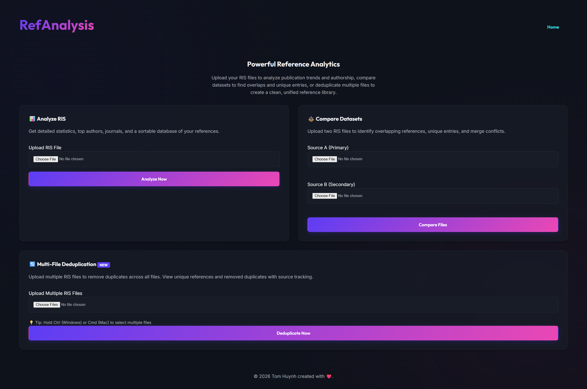

# RIS Reference Compare and Analysis System



A powerful, modular, and user-friendly web application for analyzing and comparing RIS citation files. Built with Flask and designed with a premium, responsive UI.

## 🚀 Key Features

### 1. 📊 Advanced Analysis
Upload individual RIS files to get instant insights:
*   **Statistics Dashboard**: View total references, unique authors, and journal counts.
*   **Visualizations**: Interactive charts for publications over time and top authors.
*   **Smart Table**: A sortable, responsive table displaying all references with DOI links.

### 2. ⚖️ Intelligent Comparison
Compare two RIS datasets (Source A vs. Source B) to handle deduplication and merging:
*   **Overlap Detection**: Automatically identifies common references using fuzzy matching (Title + Year normalization).
*   **Unique Reference Lists**: Clearly separates references unique to each source.
*   **Conflict Resolution Support**: Helps researchers merge libraries without duplicates.

### 3. 🎨 Premium Experience
*   **Modern Design**: Dark mode aesthetic with glassmorphism elements and deep gradients.
*   **Responsive**: Fully functional on desktop, tablet, and mobile.
*   **Fast**: Built with lightweight Vanilla CSS and optimized Python logic.

## 🛠️ Tech Stack

*   **Backend**: Python 3, Flask
*   **Frontend**: HTML5, Vanilla CSS (Custom properties & Flexbox/Grid), JavaScript
*   **Data Processing**: Pandas, OpenPyXL
*   **Visualization**: Chart.js

## 📦 Installation

1.  **Clone the repository**:
    ```bash
    git clone <repository-url>
    cd references_compare_analysis
    ```

2.  **Create a Virtual Environment**:
    ```bash
    python3 -m venv venv
    source venv/bin/activate  # On Windows use: venv\Scripts\activate
    ```

3.  **Install Dependencies**:
    ```bash
    pip install -r requirements.txt
    ```

## 🚀 Usage

1.  **Start the Server**:
    ```bash
    python app.py
    ```

2.  **Access the App**:
    Open your browser and navigate to `http://127.0.0.1:5000`

## 📁 Project Structure

```text
references_compare_analysis/
├── app.py                 # Main Flask Application
├── requirements.txt       # Python Dependencies
├── src/
│   ├── parser.py          # Custom robust RIS parser
│   ├── analyzer.py        # Statistical analysis logic
│   └── comparator.py      # Fuzzy matching & comparison algorithms
├── static/
│   ├── css/               # Modern CSS Design System
│   └── js/                # Client-side interactions
└── templates/             # Jinja2 HTML Templates
```

## 🔮 Future Roadmap

The system is designed to be modular. Future extensions could include:
*   **Export Functionality**: Export comparison results to CSV/Excel or new RIS files.
*   **Advanced Deduplication**: Configurable similarity thresholds for matching.
*   **BibTeX Support**: Add parsers for other citation formats.
*   **User Accounts**: Save analysis history and managed libraries.

## 📄 License

This project is open source and available under the MIT License.
